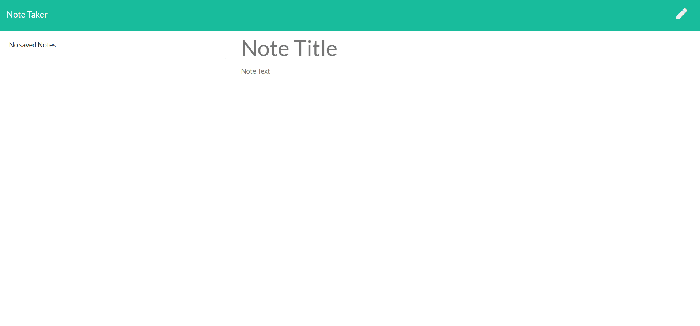

# Note Taker

 

  ### Description
  A simple application that takes user inputs and stores or delete their notes. It depends on express and node.js fs module.
  
  ### Table of Contents
  - [Description](#description)
  - [Demo](#Demo)
  - [Implementation](#Implementation)
  - [Installation](#installation)
  - [Usage](#usage)
  - [Contribution](#Contribution)
  - [Questions](#questions)
  - [License](#license)

  ### Demo
 
 [Note Taker Live Link](heroku_link_here/)

  ### Implementation
  Utilize express npm package and fs module.

  ### Installation
  npm install of express npm package is required.

  ### Usage
  Install npm dependencies, then run <i>server.js</i> in the terminal, then visit the localhost:port for the local version of the site. Otherwise visit the [Note Taker Live Link](heroku_link_here/).

  ### Contribution
  Kai Dong

  ### Questions
  Contact me for questions at dongkai981@gmail.com 
  Find me on GitHub: https://github.com/kaidong-chr

  ### License
  Copyright © 2020 Kai Dong 